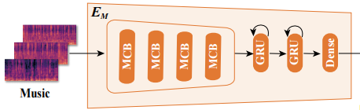
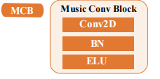
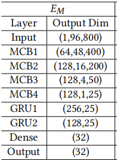

## Unsupervised-Rhythm-Clustering-Embedding

### encoder structure



#### MCB block



可以任意指定每层的输出维度（但由于底层是通过调节`nn.conv2d`的kernel_size实现的，所以当维度设置得不太合理时（比如在`MCB`中间层试图扩大后两维的维度，会导致kernel_size为负），可能会导致程序报错，所以尽量参考原论文的维度设置，如下图）



### two-step trainning

Unsupervised-Rhythm-Clustering-Embedding的本质，是在上游模型提取特征的基础上，再进行聚类的训练

对于上游特征提取，有contrastive learning或者autoencoder这两种比较经典的无监督特征提取方法

对于下游聚类训练，可见原论文中参考的[DEC](https://arxiv.org/pdf/1511.06335v2.pdf)，通过t分布来衡量嵌入点和聚类中心的相似度`q_ij` = $\frac{(1-||z_i-\mu_j||^2)^{-\frac{\alpha + 1}{2}}}{\sum_j^{'}(1-||z_i-\mu_j^{'}||^2)^{-\frac{\alpha + 1}{2}}}$，再将`q`和目标相似度`target`= $\frac{q^{2}_{ij}/f_{j}}{\sum_{j^{'}}q^{2}_{ij^{'}}/f_{j}}$计算kl散度作为损失函数（$f_j = \sum_i q_{ij}$）。

#### contrastive learning

调用官方simclr实现，传入一个`encoder`即可，对于`encoder`的限制很宽松，只需要尾接一个命名为self.fc的nn.linear层即可，在官方的simclr实现中会将这个层替换为nn.Identity，为了便于下游任务，self.fc的in_features和预先设定的`feature_dim`保持一致

#### clustering learning

和传统对比学习不同的是，DEC不需要冻住上游模型，因为dec可训练的参数只有聚类中心。经试验发现，DEC需要的epoch并不多，否则聚类簇会倾向于聚类成线

`class` `ClusteringLearning` need a `encoder` and `clustering ` 

#### Trainning data

数据可以在[google drive](https://drive.google.com/file/d/1lyy-enxsv6CJiSAcUB2BaWC2FxFO9Mf_/view?usp=sharing)下载，解压到data文件夹下即可

### repo 文件说明
`train.py`:
```bash
python train.py --task contrastive --max_epochs 100
```
在`runs`文件夹下得到上游任务的checkpoint

```bash
python train.py --task clustering --max_epochs 20 --upstream_checkpoint_path your_contrastive_checkpoint_path
```
在`runs`文件夹下得到下游任务的checkpoint

`plotit.py`:
```bash
python plotit.py  --upstream_checkpoint_path your_contrastive_checkpoint_path
```
在`png`文件夹下得到`show.png`可视化特征的聚类效果。`plotit.py`仅支持num_class <= 10的分类别绘制，如要扩展颜色数，则需在`visualization.py`的`color`函数里增加颜色

`model/music.py`:
对音乐数据（shape=[B,1,96,800]）的encoder函数

`module/learning.py`:
上下游任务的训练函数
